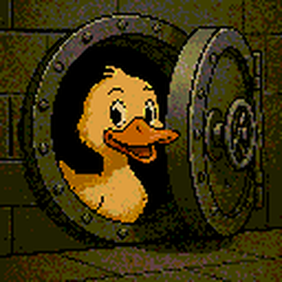
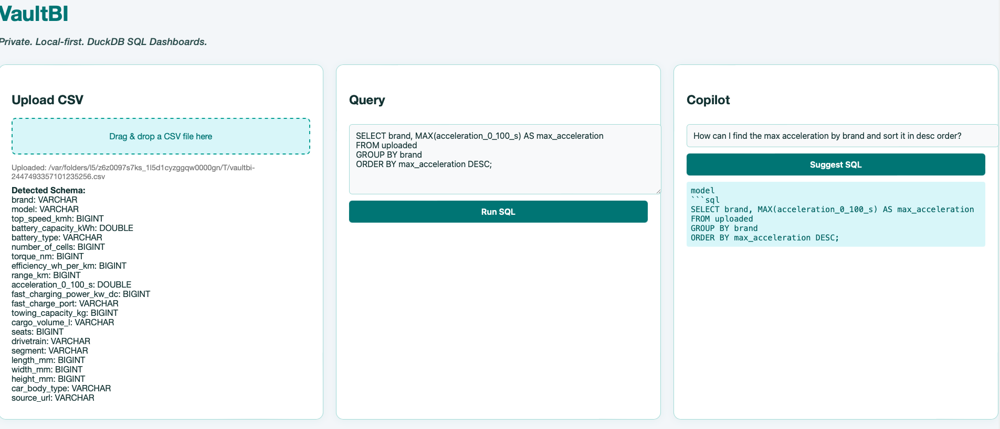
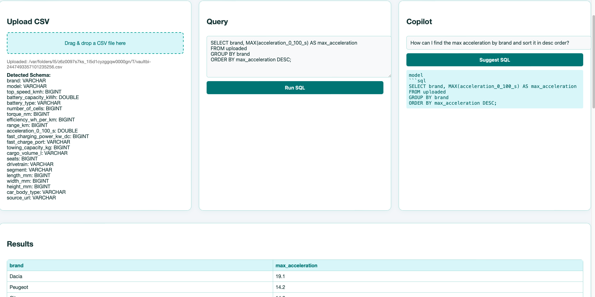
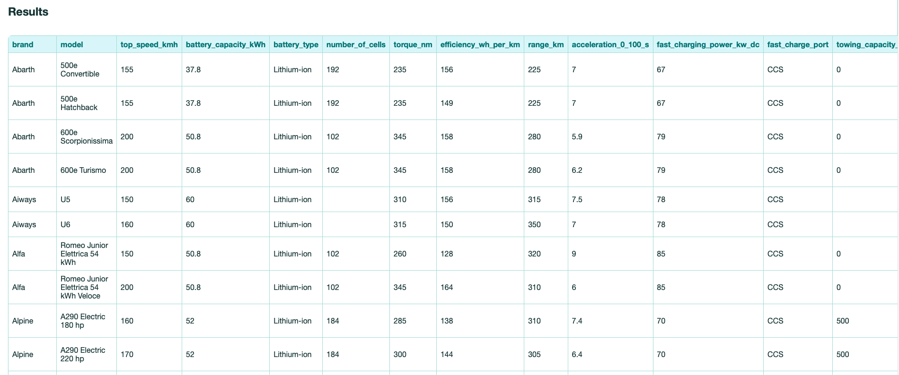

# VaultBI

**VaultBI** is a private, local-first SQL dashboard application powered by [DuckDB](https://duckdb.org/) and enhanced with a natural language Copilot. Upload CSV files, explore your data with SQL, and get AI-powered query suggestions—all in your browser, with no data leaving your machine.

---

## Features

- **Private & Local-First:** All data and computation stay on your machine.
- **CSV Upload:** Drag and drop CSV files to instantly load data into DuckDB.
- **Schema Detection:** Automatic schema extraction and display.
- **SQL Query Editor:** Write and run SQL queries directly in the browser.
- **AI Copilot:** Generate SQL queries from natural language questions using a local LLM (via llama.cpp).
- **Modern UI:** Responsive, teal-themed interface for a professional experience.
- **Results Table:** View query results in a clean, interactive table.

---

## Getting Started

### Prerequisites

- Java 17+
- [DuckDB](https://duckdb.org/) (included as a dependency)
- [llama.cpp](https://github.com/ggerganov/llama.cpp) and a compatible local LLM model (e.g., Gemma)

### Installation

1. **Clone the repository:**
    ```bash
    git clone https://github.com/oglego/vaultbi.git
    cd vaultbi
    ```

2. **Build and run the Spring Boot application:**
    ```bash
    ./mvnw spring-boot:run
    ```
    or
    ```bash
    ./gradlew bootRun
    ```

3. **Ensure `llama.cpp` and your model are available at the paths specified in `CopilotController.java`.**

4. **Open your browser and go to:**
    ```
    http://localhost:8080
    ```

---

## Usage

1. **Upload a CSV:**  
   Drag and drop your CSV file into the upload area. The schema will be detected and displayed.

2. **Query your data:**  
   Write SQL queries in the editor and click "Run SQL" to see results.

3. **Use Copilot:**  
   Enter a natural language question (e.g., "total sales by region") and click "Suggest SQL." The Copilot will generate a SQL query for you.

4. **View Results:**  
   Query results are shown in a responsive table below the cards.

---

## Project Structure

```
src/
  main/
    java/
      com/vaultbi/vaultbi/
        controller/
          CopilotController.java
          QueryController.java
    resources/
      static/
        index.html
        duck-vault.png
```

---

## Configuration

- **Copilot LLM:**  
  The Copilot feature uses `llama.cpp` and a local model.  
  Update the model path and llama binary path in `CopilotController.java` as needed.

---

## License

MIT License

---

## Credits

- [DuckDB](https://duckdb.org/)
- [llama.cpp](https://github.com/ggerganov/llama.cpp)
- UI inspired by modern dashboard design trends

---

## Screenshot







---

## Contact

For questions or contributions, open an issue or pull request on GitHub.